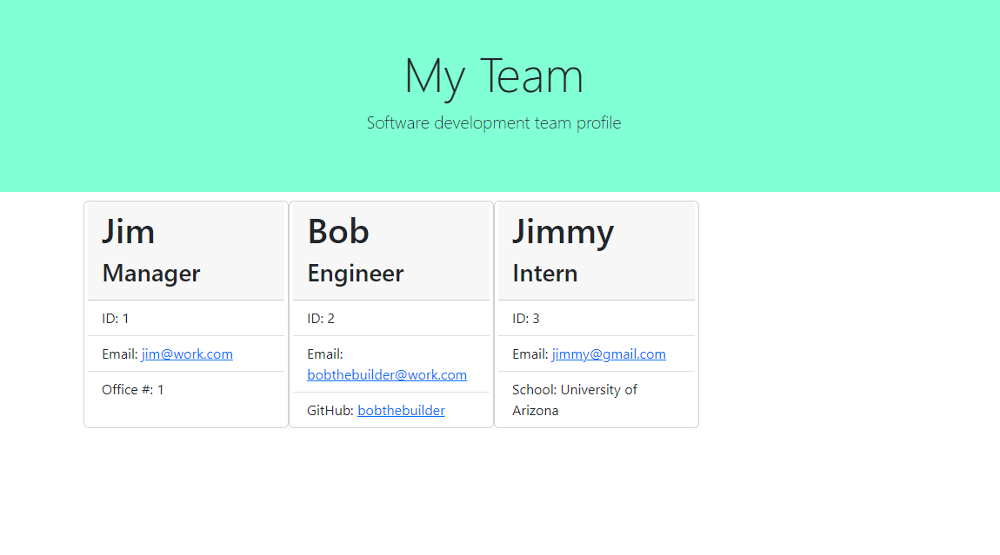

# Team Profile Generator

[Application Video Demonstration](https://drive.google.com/file/d/1Y1K5epAbBxZti1jprfQ1qKXYmI9y47oq/view)

## Purpose
The goal of Object-Oriented Programming (OOP) is to be able to group certain properties and methods together as part of a 'class' so that they can be better organized and allow for code to be reused/repurposed more easily. For this application, creating a team profile generator required the use of a base 'Employee' class which was inherited to three separate classes: Manager, Engineer, and Intern. All of these classes inherit all of the methods and properties belonging the base 'Employee' class, however they are able to selectively override existing properties/methods in addition to adding their own unique aspects.

## Design
Both the Inquirer and Jest packages were used for allowing user input and testing the application respectively.  Additionally, two custom modules were generated which were used for containing all of the necessary classes and for generating HTML based on user input. Since each employee requires different prompts, branching was based on whether the user chooses one of three given options (manager, engineer, and intern) so that the appropiate questions would be prompted to the user. Once the user selects to add no further employees, then an array containing all of the generated employees is passed to the 'generateHTML' function and it creates cards for each individual employee with their relevant information displayed. Once all employees markup has been generated, then the raw markup is passed to the file system 'writeFile' function and the file is written locally. To style the webpage, Bootstrap was used alongside some custom styling.

---

Here's a screenshot of the finished application:
